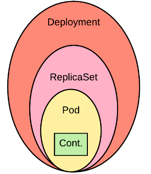

# ReplicaSets

**ReplicaSets** es un objeto básico de Kubernetes que permite dar **Hig Availavility** a **Pods**.



Su **spec** contiene un plantilla del *spec de un pod*.

```yaml
apiVersion: apps/v1
kind: ReplicaSet
metadata:
  name: nodejs-example
  namespace: default
spec:
  replicas: 5
  minReadySeconds: 20
  selector:
    matchLabels:
      app: nodejs
  template:
    metadata:
      labels:
        app: nodejs
        role: example
        version: v1
    spec:
      containers:
        - name: app
          image: semoac/nodejs-example:latest
          ports:
            - containerPort: 3000
              protocol: TCP
          env:
            - name: PORT
              value: "3000"
            - name: NS
              valueFrom:
                fieldRef:
                  fieldPath: metadata.namespace
            - name: HEALTH_STATUS
              value: "500"
          livenessProbe:
            tcpSocket:
              port: 3000
            initialDelaySeconds: 5
            periodSeconds: 5
          readinessProbe:
            httpGet:
              path: /health
              port: 3000
            initialDelaySeconds: 5
            periodSeconds: 3
```

En este caso `spec.selector.matchLabels` indica la lista de label que **ReplicaSet** vigilará.

**ReplicaSet** se preocupará que existan creados **5** con el label `app:nodejs` a lo largo de todo el **namespace** independiente si el Pod fue creado por él o no.

`spec.template.metadata.labels` establece los labels con que se crearán los nuevos Pods. Esto debe coincider con el `selector` definido en `spec.selector`.

Notar que al editar el ReplicaSet no se recrean los contenedores que ya estan en ejecución, lo que puede inducir inconsistencias.

ReplicaSet toma control del ciclo de vida de los pods que coincidan con la etiqueta del selector (incluye eliminación)
